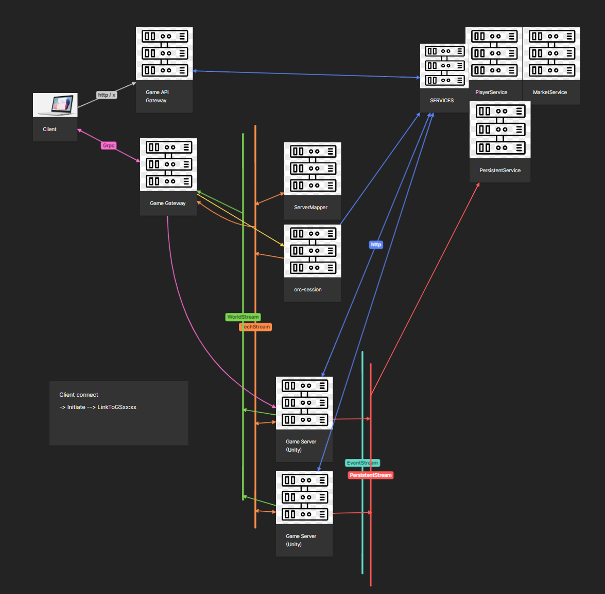

# GameUniverse

> **Note**: This project is currently in development.

### Cloud-Native Backend for Scalable Game Infrastructure

GameUniverse is a robust backend solution built for handling the complexities of scalable, cloud-based gaming infrastructure. Designed to accommodate large, persistent game worlds, GameUniverse leverages powerful technologies to ensure low-latency communication, fault tolerance, and efficient resource management for seamless gaming experiences.

---

## 🌐 Key Features

- **Cloud Scalability**: Designed for dynamic, cloud-native environments to support fluctuating player demands.
- **Resilient Game Server**: Supports any physics engine to maintain real-time interactions.
- **Low-Latency Communication**: Ensures smooth player interactions and real-time feedback via gRPC and socket connections.
- **Asynchronous Messaging**: Employs Kafka for reliable message brokering and event handling.
- **Containerized Deployment**: Simplifies deployment and management through Docker, Helm, and Kubernetes.

---

## 🛠️ Technologies

| Tech         | Description                                    |
|--------------|------------------------------------------------|
| **Java**     | Core backend logic built using Spring and Micronaut frameworks. |
| **Docker**   | Ensures isolated, reproducible environments for each service. |
| **Helm**     | Helm charts facilitate easy Kubernetes deployments. |
| **Kubernetes (K8s)** | Manages containerized applications in cloud environments. |
| **Kafka**    | Ensures resilient and fault-tolerant event streaming and messaging. |
| **gRPC / Sockets** | Real-time communication between game servers and services. |
| **Game Server** | Configurable with any physics engine to power game mechanics. |

---

## 🎮 Game Server Architecture

The architecture focuses on reliability, efficiency, and scalability for immersive multiplayer experiences. The modular design supports future expansion and interoperability with various game engines and physics models.

---
